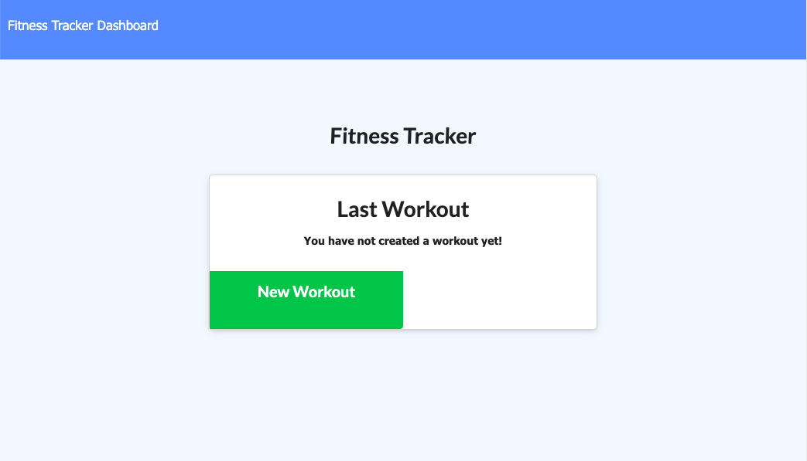

# Nosql: Workout Tracker

## Description
The application "Workout Tracker" will allows users to be able to view create and track daily workouts, also to be able to log multiple exercises in a workout on a given day. Further on, it will allows to track the name, type, weight, sets, reps, and duration of exercise.

The user should be able to:

  * Add exercises to a previous workout plan.
  * Add new exercises to a new workout plan.
  * View multiple the combined weight of multiple exercises on the `stats` page.

## Demo
### Heroku URL
[Click Here to checkout a deployed application](https://classique-monsieur-44499.herokuapp.com/)
### Screenshots

## Instruction
  * The first page of application will appears as `You have not created a workout yet!`, and will gives only one option to click which is `New Workout`.
  * Once an user clicks `New Workout`, there are many workout options based on selection between `cardio` and `resistance`.
  * In the navigation bar, `Fitness Tracker` menu will gives a summary of past workouts. `Dashboard` menu will gives an overall charts and workouts weekly.

## License

- **[MIT License](https://opensource.org/licenses/MIT)** 
- 2020 Workout Tracker

## Questions
| Ask me Now! |
| :---: |
|  |
| <a href="https://github.com/nuleeannajeon" target="_blank">Checkout Github Profile</a> |
